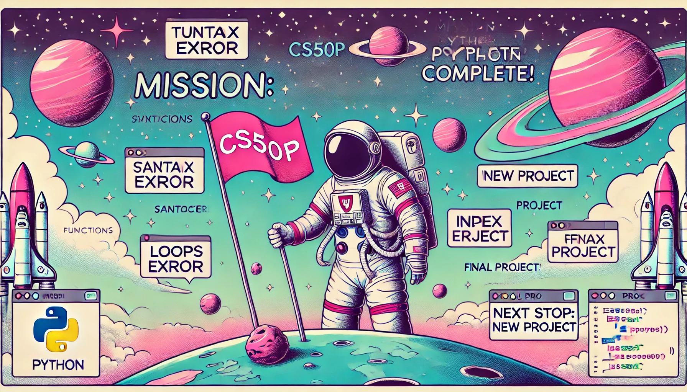

# CS50's Introduction to Programming with Python (Harvard University)

Welcome to my repository containing the coding exercises and the final project I completed for **CS50’s Introduction to Programming with Python (CS50P)** by **Harvard University**. This journey required a lot of time and effort, but I am incredibly proud of what I have learned and accomplished.

---

## About the Course

**CS50P** is an introductory programming course taught by **David J. Malan** at **Harvard University**. It teaches the fundamentals of Python programming through hands-on problem sets and a final project. The course covers key programming concepts such as functions, loops, conditionals, exceptions, libraries, unit tests, regular expressions, and object-oriented programming.

📌 **Official Course Website:** [CS50P on Harvard’s OpenCourseWare](https://cs50.harvard.edu/python/2022/)

This course is suitable for beginners and requires no prior programming experience. It is also part of **HarvardX** on edX, where students can earn a **verified certificate** upon completion.

---

## Course Structure

The course consists of **10 chapters** (starting from 0, following Python’s convention):

0. Functions & Variables
1. Conditionals
2. Loops
3. Exceptions
4. Libraries
5. Unit Tests
6. File I/O
7. Regular Expressions
8. Object-Oriented Programming
9. Et Cetera

Each chapter contains a **problem set** with coding exercises that apply the learned concepts.

---

## Problem Sets & Final Project Overview

This repository contains my solutions to the **problem sets** and the **final project**.

### **Problem Set 0**
- Indoor Voice
- Playback Speed
- Making Faces
- Einstein
- Tip Calculator

### **Problem Set 1**
- Deep Thought
- Home Federal Savings Bank
- File Extensions
- Math Interpreter
- Meal Time

### **Problem Set 2**
- camelCase
- Coke Machine
- Just Setting Up My Twttr
- Vanity Plates
- Nutrition Facts

### **Problem Set 3**
- Fuel Gauge
- Felipe’s Taqueria
- Grocery List
- Outdated

### **Problem Set 4**
- Emojize
- Frank, Ian, and Glen’s Letters
- Adieu, Adieu
- Guessing Game
- Little Professor
- Bitcoin Price Index

### **Problem Set 5**
- Testing my twttr
- Back to the Bank
- Re-requesting a Vanity Plate
- Refueling

### **Problem Set 6**
- Lines of Code
- Pizza Py
- Scourgify
- CS50 P-Shirt

### **Problem Set 7**
- NUMB3RS
- Watch on YouTube
- Working 9 to 5
- Regular, um, Expressions
- Response Validation

### **Problem Set 8**
- Seasons of Love
- Cookie Jar
- CS50 Shirtificate

### **Problem Set 9: Final Project**
The **final project** is the climax of the course. For my project, I built **SlideSift** – a Python tool that removes redundant slides from PDFs automatically.

#### **Final Project: SlideSift**
📌 **Project Description:**
- SlideSift analyzes presentation slides exported as PDFs.
- It applies a **rule-based approach** to detect incremental builds.
- It removes redundant slides, keeping only the most complete versions.
- Uses **PyMuPDF and PyPDF2** for PDF processing.
- Comes with a **graphical user interface (GUI)** for easy use.

📌 **Features:**
✔ GUI for selecting input/output PDFs  
✔ Automated slide filtering  
✔ Efficient processing using PyMuPDF & PyPDF2  
✔ Fully tested with pytest  

---

## How to Use This Repository

1. Clone this repository:
   ```bash
   git clone https://github.com/BertVos-79/CS50P-Problem-Sets-Final-Project.git
   ```
2. Navigate to a problem set directory and explore the solutions.
3. Run the scripts using Python 3.
4. For the final project, install the required dependencies:
   ```bash
   pip install -r requirements.txt
   ```
5. Run **SlideSift**:
   ```bash
   python project.py
   ```

---

## Conclusion

Completing **CS50P** was an enriching experience that helped me develop strong Python programming skills. I hope this repository serves as a helpful reference for anyone taking the course or looking to improve their Python skills.

If you find this repository useful, feel free to **star ⭐ the repo** on GitHub!

Happy Coding! 🚀
